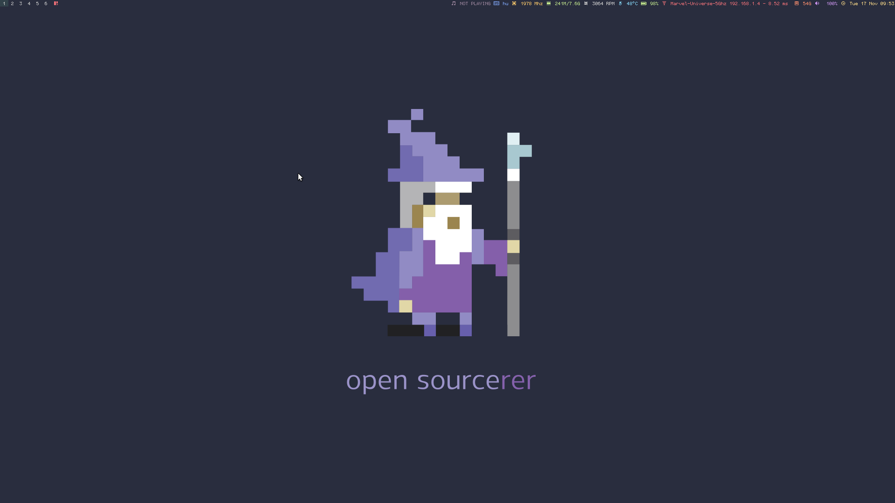
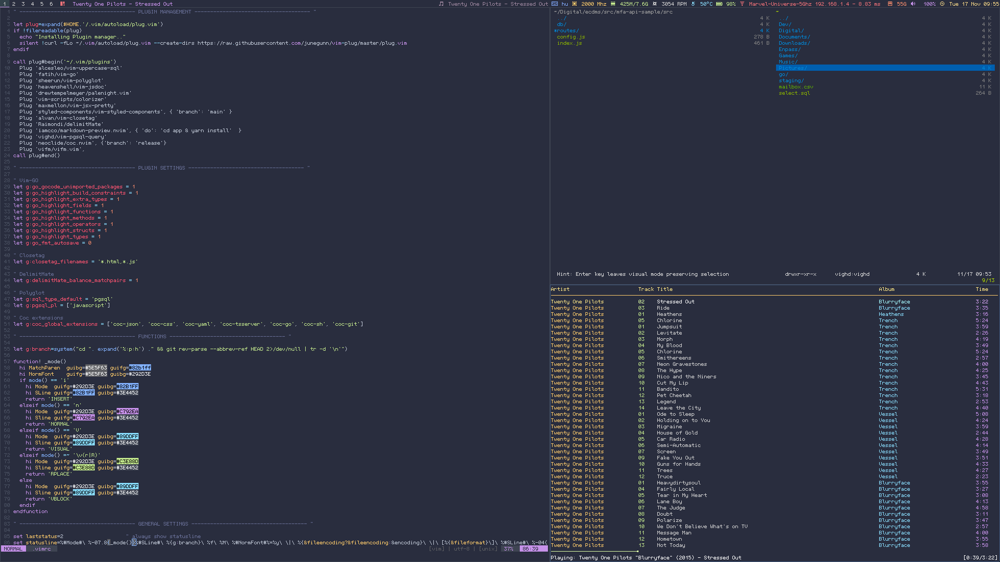

# Ultimate DWM

This is my very own customized fork of 'suckless dwm' dwm.suckless.org.

I tried to keep it simple so I didn't add big changes.

This fork contains the following patches:

- [statusallmons](https://dwm.suckless.org/patches/statusallmons)
- [fibonacchi](https://dwm.suckless.org/patches/fibonacci)
- [pertag](https://dwm.suckless.org/patches/pertag)
- [quit](https://github.com/jceb/dwm-patches/blob/master/patches/restart.patch)
- [center](https://dwm.suckless.org/patches/center)
- [warp](https://dwm.suckless.org/patches/warp)
- [status2d](https://dwm.suckless.org/patches/status2d)

And contains all of the changes that committed into the upstream.

I’m using some small and pixelperfect fonts (with symbols) in this fork so huge thanks to [addy](https://github.com/addy-dclxvi/bitmap-font-collections) who created this fonts. Yes it is a bitmap font which is no longer supported, but I turned them into a OpenType version.
The colorscheme what I using inspired by the creator of the Vim's [palenight](https://github.com/drewtempelmeyer/palenight.vim) colorscheme.

Userspace tools (dependencies) what I using with this environment:

- dmenu
- btmenu
- networkmanager_dmenu
- termite
- chromium
- vifm
- alsamixer
- amixer
- pactl
- xbacklight
- sfplock
- maim
- xlayoutdisplay
- mpc
- [dwm-statusbar](https://github.com/vighd/environment-scripts/blob/master/dwm-statusbar)

You can find my configs and fonts for the userspace tools: https://github.com/vighd/dotfiles/tree/development/configs/home/vighd

## And some screenshot

